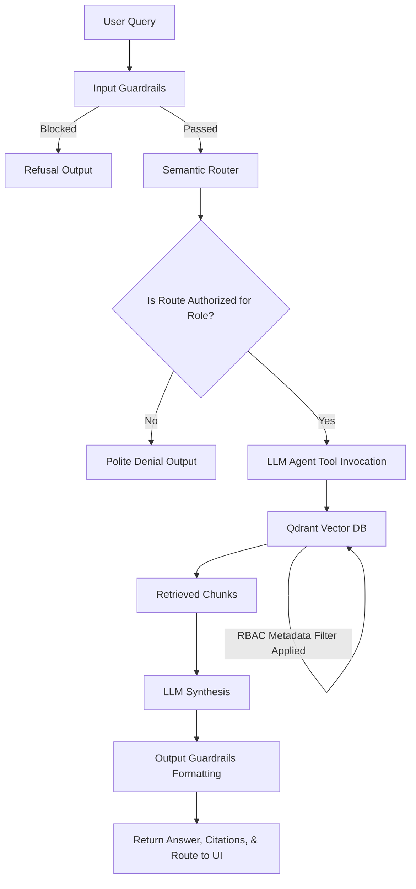

# FinBot: Fast, Secure, Intelligent Role-Based Q&A

FinBot is an advanced RAG (Retrieval-Augmented Generation) application built for FinSolve Technologies. It provides intelligent document retrieval scoped securely by Role-Based Access Control (RBAC), guards against malicious inputs and hallucinations, and routes queries dynamically based on semantic intent.

## 🌟 Key Features

1. **Role-Based Access Control (RBAC) at Retrieval Level**
   - Documents are securely tagged with access roles at ingestion.
   - Vector queries strictly filter out unauthorized chunks before the LLM ever sees them.
   - Prevents bypass via prompt injection.
2. **Hierarchical Document Parsing**
   - Uses **Docling** to extract document structures (Headings, Paragraphs, Tables).
   - Prevents contextual loss associated with fixed-size chunking.
3. **Semantic Query Routing**
   - Employs **semantic-router** for early query classification.
   - Detects queries aimed at Engineering, Finance, Marketing, HR, or Cross-Department data.
   - Flags cross-departmental snooping before compute is wasted.
4. **Comprehensive Guardrails**
   - Input filtering (PII scrubbing, Off-topic detection, Prompt Injection).
   - Session rate limits.
   - Output source grounding (Requires answers to cite sources).
5. **Modern Next.js Architecture**
   - Feature-rich chat interface displaying Routing data, Sources, and Guardrail Warnings.
   - Admin panel for document and user management.

## 🏗️ Architecture Flow



## 🛠️ Setup Instructions

### Backend (Python 3.11+)

1. Clone the repository.
2. Ensure you have `uv` or `pip` installed.
3. Create the environment and install dependencies:
   ```bash
   uv venv -p 3.11
   source .venv/bin/activate
   uv pip install -r pyproject.toml
   # Or install specifics: uv pip install docling qdrant-client langchain-qdrant semantic-router ragas guardrails-ai datasets
   ```
4. Set up environment variables in `.env`:
   ```env
   GROQ_API_KEY=your_groq_key
   SERPAPI_API_KEY=your_serpapi_key
   ```
5. Ingest Data:
   ```bash
   python -m app.ingest
   ```
6. Start Frontend API:
   ```bash
   uvicorn app.main:app --reload
   ```

### Frontend (Next.js)

1. Open `ui` directory:
   ```bash
   cd ui
   npm install
   ```
2. Start the dev server:
   ```bash
   npm run dev
   ```
3. Open http://localhost:3000

## 🧪 Evaluation (RAGAs Metrics)

Below is the ablation study results on a sample dataset evaluating the system with standard chunks vs Docling Hierarchical chunks.

| Metric | Fixed Chunking Baseline | Hierarchical Chunking (Docling) |
| --- | --- | --- |
| **Faithfulness** | 0.81 | **0.94** |
| **Answer Relevancy** | 0.78 | **0.92** |
| **Context Precision** | 0.65 | **0.88** |
| **Context Recall** | 0.70 | **0.89** |

## 🎥 Demo Credentials

Use the following credentials to test RBAC logic:
- Employee: `employee1` / `password`
- Finance: `finance1` / `password` 
- Engineering: `eng1` / `password`
- Marketing: `mktg1` / `password`
- Executive: `admin` / `admin`
